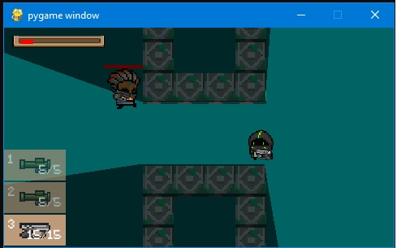

## Ascent
10-3 Паус Александр 
Стек технологий: Python 3.10

### Описание:

Создается новое окно pygame. В этом окне создается фон, игрок, а также блоки.
И игрок и блоки представляют из себя разноцветные прямоугольники. Игроком можно управлять 
клавишами WASD. Блоки обладают коллизией, т.е. игрок не может проходить через них.
При движении игрока камера смещается так, чтобы он был по центру. При перемещении мышки 
камеру сдвигается в сторону курсора на определенное расстояние.

### План работы:
	
Игрок(player) - Исправление ошибки с увеличенной скоростью при движении по диогонали.
Отражение спрайта игрока в зависимости от положения курсора на экране. Выбор анимации в
зависимости от типа события( бездействие, движение смерть).Возможность использования игроком
способности и её создание. Использование уворота по нажатию кнопки. Создание монет и возможность
их траты у торговца.
	Трудоёмкость этапа - 3 часа.
- [x] Движение по диагонали
- [x] Поворот спрайта
- [x] Выбор анимации
- [x] Способность
- [x] Уворот
- [x] Деньги

	Анимации(animated)- Написание класса способного запускать анимации 
объектов(игрока, противников), удалять объекты, обновлять экран и искать угол по двум 
точкам(для дальнейшего поворота некоторых объектов). 
	Трудоёмкость этапа - 2 часа.
- [x] Анимации
- [x] Удаление
- [x] Обновление
- [x] Поиск угла
	
	Группа(group) - Написание класса группы, способного рисовать все объекты добавленные в
группу, удалять их,обновлять на экране проверять столкновения объектов двух групп и проверять столкновения
 одного спрайта с другой группой.
	Трудоёмкость  этапа - 1 час.
- [x] Рисование
- [x] Удаление, добавление
- [x] Обновление
- [x] Столкновение двух групп
- [x] Столкновение спрайта и группы

	Оружие(weapon) - Создание классов оружия и пули. Поворот оружия в зависимости
от положеняи курсора на экране.Возможность поднятия лежащего оружия по нажатию кнопки.
Возможность стрельбы по нажатию кнопки мыши. Реализация скорости полета, урона,
скорострельности, количества патронов, перезарядки и времени жизни пули.
Уменьшение здоровья игрока\\противников при попадании пули. Возможность переключения 
между оружиями.
	Трудоёмкость этапа - 3.5 часа.
- [x] Поворот оружия
- [x] Поднятие
- [x] Стрельба
- [x] Реализации характеристик оружия:
	* [x] Скорость полета
	* [x] Урон
	* [x] Скорострельность
	* [x] Количество патронов
	* [x] Перезарядка
	* [x] Время жизни пули
- [x] Уменьшение здоровья
- [x] Переключение
	
	Враг(enemy) - Создание врагов и их анимация.Поворот врага в зависимости от
направления движения.Написание ИИ для врагов:Движение, стрельба.Удаление врагов
через некоторое время после их уничтожения. Выпадение монет после уничтожения.
	Трудоёмкость этапа - 4 часа.
- [x] Анимация
- [ ] ИИ
	* [x] Стрельба
	* [x] Движение
- [x] Удаление

	Обычные Комнаты(default room) - Создание класса комнаты. Создание границ и генерация блоков 
внутри комнаты. Генерация противников.Возможность выхода только после уничтожения 
всех противников. Создание сундука после прохождения комнаты. 
	Трудоёмкость этапа - 5 часов
- [x] Границы
- [x] Блоки
- [x] Генерация противников
- [x] Возможность выхода
- [ ] Сундук

	Специальные комнаты(special room) - Создание комнаты с торговцем. Создание комнаты с сундуком.	
	Трудоёмкость этапа - 2 часа.	
- [ ] Торговец
- [ ] Комнаты с сундуком
	
	Перки(perks) - Создание перков.Возможность выбора перка после прохождения уровня. 
	Трудоёмкость этапа - 1.5 часа
- [ ] Создание
- [ ] Выбор

	Уровень(level) - Генерация уровня: генерация обычных комнат, комнат с сундуками, торговцев,
проходов между комнатами. Создание миникарты уровня.
	Трудоёмкость этапа - 5 часов.
- [] Генерация уровня
	* [x] Комнаты
	* [ ] Комнаты с сундуком
	* [ ] Торговец
	* [x] Переходы
- [ ] Миникарта
	
	Интерфейс(interface) - Создание стартового экрана.Возможность изменения размеров экрана.
Возможность изменения кнопок управления.Отображение хп игрока, денег,времени перезарядки способности,
меню оружия.
Трудоёмкость этапа - 5 часов
- [x] Стартовое меню 
- [x] Изменение экрана
- [x] Кнопки управления
- [ ] Отображение 
	* [x] Хп
	* [ ] Денег
	* [x] Перезарядки способности
	* [x] Меню оружия	

	

 
	

	
	
